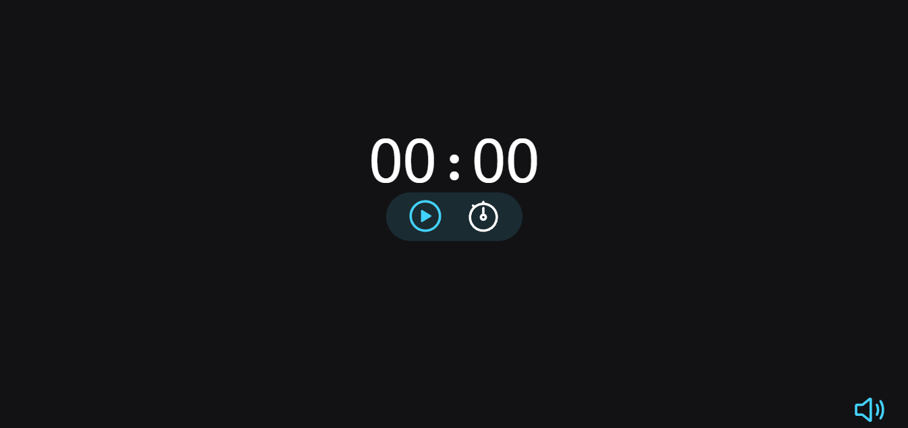
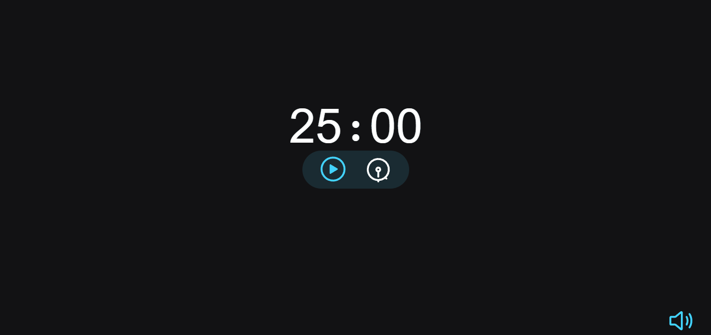

# Temporizador

  <a href=''>Acrescente</a>
  <a href=''>Decrescente</a>

### Modo acrescente

Permite o usuário usar o temporizador como um cronometro, ideal para descobrir quanto tempo leva para concluir determinada tarefa
 

### Modo decrescente

Permite o usuário usar o temporizador como um timer, ideal para o método Pomodoro. O usuário é livre para escolher o tamanho do ciclo
 

